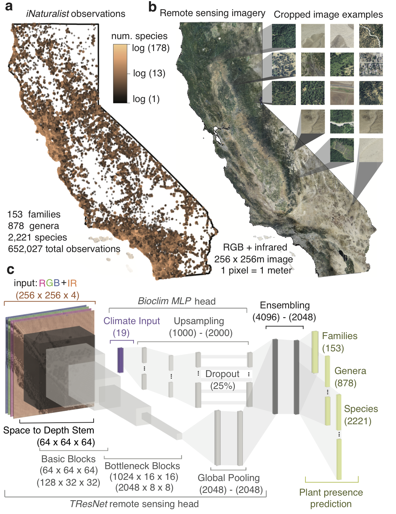
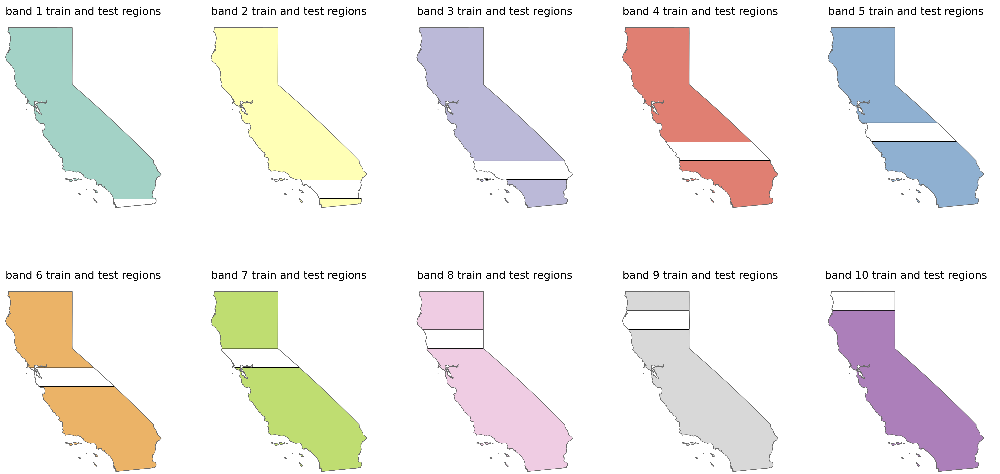
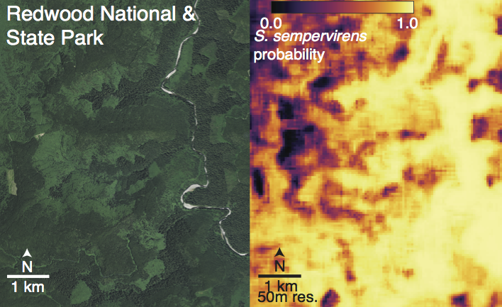
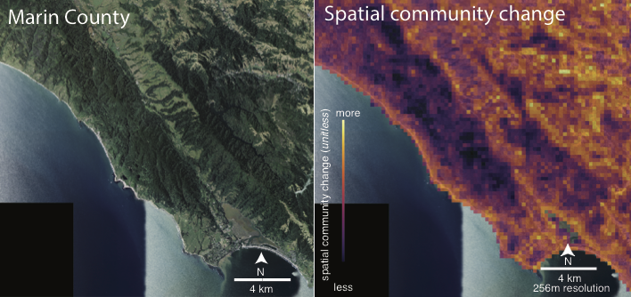
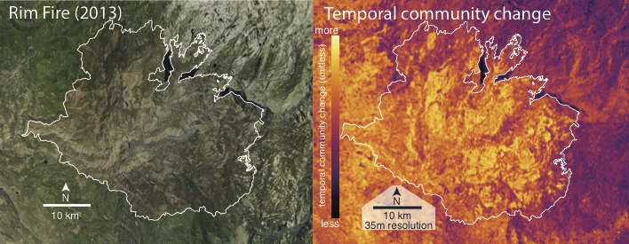

# *Deepbiosphere*: Mapping plant species with citizen science, remote sensing, and deep learning
Open-source implementation for plant species distribution mapping using citizen science, remote sensing, and deep convolutional neural networks. Code for downloading the citizen science data, generating the training and testing datasets, training the deep neural networks, fitting baselines, and making maps of species distributions can be found here. Further details and analyses can be found in the [preprint](https://www.biorxiv.org/content/10.1101/2022.08.16.504150v3).




## Installing *Deepbiosphere*

In order to run programs from *deepbiosphere*, there are some prerequisite programs that are required. The necessary programs and program versions that have been verified to work are:

| Program | Version | 
| -----   | ----- | 
| Python | 3.7+| 
| Pytorch | 1.1+ | 
| CUDA | 10.0+ | 
| GCC / C++ | 3.6+ |
| R | 3.4+ | 

### Setting up the virtual environment

Before you begin the process of installing the *deepbiosphere* code base, we highly recommend you set up a [virtual / conda environment](https://whiteboxml.com/blog/the-definitive-guide-to-python-virtual-environments-with-conda) for the project. In this virtual environment, you'll need at least **Python 3.7** for the code in this project to work, and it's always safest and best practice to keep a fresh python install for your projects to prevent versioning conflicts in installed packages across projects. 

### Installing PyTorch

In addition, before you can install *deepbiosphere*, you'll need to install a version of [PyTorch](https://pytorch.org/) that is compatible with the GPU you'll be using and the CUDA library version you have. To figure out what versions are compatible, find the [GPU architecture](https://docs.nvidia.com/cuda/cuda-compiler-driver-nvcc/index.html#gpu-feature-list) that corresponds to your GPU (a nice walkthrough of what this means can be found [here](https://stackoverflow.com/questions/68496906/pytorch-installation-for-different-cuda-architectures) and [here](https://arnon.dk/matching-sm-architectures-arch-and-gencode-for-various-nvidia-cards/)), plus the version of CUDA / NVCC that you have on your machine (displayed by running `nvidia-smi`) and find the version of PyTorch that matches the version of CUDA you're using either from [main download](https://pytorch.org/) page or the [previous versions](https://pytorch.org/get-started/previous-versions/) page. You will need at least CUDA 10.0 for the code in this project to compile correctly. To figure out your CUDA version and see if it's properly installed on your system, you can run `nvidia-smi`. For additional clarifications on how to set up PyTorch for your system, please refer to the [documentation provided](https://github.com/pytorch/pytorch#from-source).

### Other dependencies

Once you've downloaded and tested you have a functioning version of PyTorch, there are a few more required programs you'll need to either set up or load before you can download *deepbiosphere*. First, you'll need at least version 3.4+ of R to run [rpy2](https://rpy2.github.io/doc/v3.0.x/html/overview.html). Second, you'll need C++ to compile the [inplace-abn](https://pypi.org/project/inplace-abn/) libarary utilized by the CNN  that comprises part of the *deepbiosphere* neural network architecture. According to the [inplace-abn](https://github.com/mapillary/inplace_abn) repository and in our experience, GCC versions 6.4 and 6.5 have been confirmed to work, but newer versions should work as well. There is no guarantee an older version of GCC will work. 

### Pip installing *deepbiosphere*

To install the *deepbiosphere* code, you can use pip from the command line: `pip install -e git+https://github.com/moiexpositoalonsolab/deepbiosphere`. To be able to edit the code inside the repository on your machine, we recommend you add the edit `-e` flag to the `pip install` command so that the environment where you pip installed the project will [reflect any changes you make](https://www.reddit.com/r/learnpython/comments/ayx7za/how_does_pip_install_e_work_is_there_a_specific/). 

### Troubleshooting dependencies

Installing *deepbiosphere* will install all of its dependent packages as well, including two specific packages that may be troublesome to install. The first is [inplace-abn](https://github.com/mapillary/inplace_abn#installation), which contains native C++/CUDA code and requires C++/GCC to be loaded on the system (as described above). Even when using the correct version of GCC, depending on your GPU architecture and operating system setup, you may need to force the `inplace-abn` pip installation to compile CUDA, as outlined [here](https://github.com/mapillary/inplace_abn#force-compiling-with-cuda). You'll also need to do a force-CUDA install if you **use multiple different GPU architectures** with the same virtual environment. To force compilation for the GPU architectures you'll be working with, first find the gencodes of the GPUs you'll be compiling for from this list of [NVIDIA GPU gencodes](https://arnon.dk/matching-sm-architectures-arch-and-gencode-for-various-nvidia-cards/), then add the `TORCH_CUDA_ARCH_LIST` environmental variable to your session, along with the `IABN_FORCE_CUDA` environmental variable, as follows below:
```
# $ export TORCH_CUDA_ARCH_LIST='K1.N1;K2.N2;…'
# where `K.N` stand for gencodes for all the GPU architectures you might use
# ie: sm_60 -> 6.0
$ export TORCH_CUDA_ARCH_LIST='6.0;6.1;7.0'
$ export IABN_FORCE_CUDA=1
```
Then, try pip installing *deepbiosphere* again. A few troubleshooting tips for compiling `inplaca-abn`:
1. Does running `nvidia-smi` print anything? If not, CUDA isn't loaded and/or your GPU isn't visible from the terminal session you're working in, thus `inplace-abn` won't be able to compile.
2. If using a large cluster with mutiple nodes and different kinds of GPUS, does `inplace-abn` work for one type of node / GPU but not the other? Chances are `inplace-abn` was compiled just for one of the types of GPUs available. You'll need to re-install `inplace-abn` and use the `TORCH_CUDA_ARCH_LIST` with the appropriate GPU architectures you'll be using provided, as mentioned above.
3. If you're getting linked library errors, it could be missing linked libraries, described [here](https://stackoverflow.com/questions/49875588/importerror-lib64-libstdc-so-6-version-cxxabi-1-3-9-not-found) and [here](https://stackoverflow.com/questions/58424974/anaconda-importerror-usr-lib64-libstdc-so-6-version-glibcxx-3-4-21-not-fo). In our experience, the root problem was actually PyTorch / CUDA / GCC version incompatibility errors rather than missing linked libraries, but it may nevertheless be a helpful lead if all else fails.

The other package that may cause trouble is `pygeos` or `shapely`. These packages talk to [libgeos](https://libgeos.org/), and [PROJ](https://proj.org/en/9.3/), and can also sometimes be out of version with the default versions `pip install` is expecting. A few troubleshooting links are outlined below:
* Shapely must be [compiled without binaries](https://github.com/shapely/shapely/issues/651#issuecomment-434818437)
* [How to deal with missing linked libraries](https://stackoverflow.com/questions/72825343/geopandas-shapely-compatibility) for shapely

### Modifying the paths object

Once you've successfully installed the *deepbiosphere* codebase with `pip install`, the last thing you'll need to do is modify the paths field inside [src/deepbiosphere/Utils.py](src/deepbiosphere/Utils.py). It should look something like this:

```
paths = SimpleNamespace(
    OCCS = '/your/path/here/',
    SHPFILES = '/your/path/here/',
    MODELS = '/your/path/here/',
    IMAGES = '/your/path/here/',
    RASTERS = '/your/path/here/',
    BASELINES = '/your/path/here/',
    RESULTS = '/your/path/here/',
    MISC = '/your/path/here/',
    DOCS = '/your/path/here/',
    SCRATCH = '/your/path/here/',
    RUNS = '/your/path/here/',
    BLOB_ROOT = 'https://naipblobs.blob.core.windows.net/')
    
```
    
In order for  *deepbiosphere's* code to run properly, you'll need to edit these paths to point to the proper directories on your machine's file system. Some directories, like `IMAGES`, will require more memory than others (upwards of 500 GiB!), so you may not be able to store it in your home directory if using a centralized compute cluster or your personal machine. Other directories like `OCCS` will store at max 5 GiB of data and may fit in your home directory. Regardless, in order for *deepbiosphere* to properly read and write files on your file system, you'll need to add file paths for these directories. In general, these directories will write data rather than read it, with the exception of the `SCRATCH` directory, where the raw NAIP data is typically stored and must be downloaded ahead of time. We plan to add functionality to automatically download these files for you, but haven't fully finished implementing that feature. Once those filepaths are added, *deepbiosphere* should work as expected.

--- 
# Downloading citizen science plant observations from GBIF

All code used to download observations from the Global Biodiversity Information Facility (GBIF) can be found in [src/deepbiosphere/Download_GBIF_Data.py](src/deepbiosphere/Download_GBIF_Data.py). The general command to reproduce the dataset used to train *deepbiosphere* is:

```
python src/deepbiosphere/Download_GBIF_Data.py --gbif_user [your_username] --gbif_email [your_gbif_email] --organism plant --start_date 2015 --end_date 2022
```
### Setting up access on GBIF 
In order to run this code, you'll need to [register](https://www.gbif.org/) on GBIF's website and use your chosen username and email for authentication. You'll also need a `.netrc` file stored inside a `netrc` directory, usually `~/.netrc`. Instructions for setting up a `.netrc` file can be found [here](https://stackoverflow.com/questions/6031214/git-how-to-use-netrc-file-on-windows-to-save-user-and-password). Generally speaking, the structure of the `.netrc` should look like:
```
   machine api.gbif.org
   login <your gbif username>
   password <your pass>
```
### Citizen science occurrence record download filters
Currently, the default parameters for downloading citizen science occurrence records matches the filters for the area and time used in the original paper (the state of California from 2015-2022), but you can pass whatever administrative area you desire to pull records using the corresponding [GADM](https://gadm.org/data.html) code  (the `--area` flag) or a different time period (partitioned by year, the `--start_date` and `--end_date` flags, respectively). To modify any other filters used in the original paper (e.g.: radius of uncertainty) will require modifying the code or opening a feature request.

### Downloading the results
Be aware that the GBIF server will take time to prepare the request (which will show as the message `response status  PREPARING`). Depending on the download size and how busy the GBIF servers are, the download may take anywhere from a few minutes to many hours. The download process will wait for the data to be prepared so we recommend running it in the background using either [screen](https://www.gnu.org/software/screen/) or [tmux](https://wiki.archlinux.org/title/Tmux). Once completed, this process will save the downloaded observations as a csv  (`[taxon]_[start_date]_[end_date]_[area]_[date_of_download].csv`) as well as a metadata json  (`[taxon]_[start_date]_[end_date]_[area]_[date_of_download].json`) containing the predicates used to download the data to the directory provided in `paths.OCCS`. The requested data will also show up on your GBIF account under your profile on the website, and once the data is ready to be downloaded, you may download it directly from the website.

After downloading the data, be sure to always follow GBIF's [citation guidelines](https://www.gbif.org/citation-guidelines) for any publication or downstream product resulting from the data you downloaded.

---
# Building the training and testing dataset for *deepbiosphere*

All code used to further clean the GBIF observations, generate the NAIP image pairs, and generate the uniform and spatial cross-validation train/test splits can be found in [src/deepbiosphere/Build_Data.py](src/deepbiosphere/Build_Data.py). The general command to generate the dataset is:

```
python src/deepbiosphere/Build_Data.py --dset_path data/occurrences/[name_of_dataset_from_gbif_download].csv --daset_id [what_you_want_to_call_the_dataset] --sep '\t' --year 2012 --state ca --threshold 500 --idCol gbifID --parallel 0
```

### What files are generated

Running this command will generate a csv stored in your `paths.OCCS` directory that contains all the cleaned observations (`[what_you_want_to_call_the_dataset].csv`) and an associated metadata file (`[what_you_want_to_call_the_dataset]_metadata.json`). It will also create a directory in `paths.IMAGES` which hierarchically stores the paired NAIP image crops using the same file structure as many [NAIP imagery blobs](https://naipeuwest.blob.core.windows.net/naip/v002/ca/index.html). Each file in the directory maps to one NAIP tiff from the original imagery, and within these files are zipped numpy archives which contain the 4-band cropped images for each GBIF observation that fell within said tiff. Since GBIF observations are heterogeneously distributed, some files will only contain a few images while others will contain many. 

### Accessing the imagery data

To map which observation in the csv goes with which cropped NAIP image, in the occurrence csv the column `f'filepath_2012'` (or `f'filepath_{year}'` for using a different year of NAIP imagery) will tell you which `.npz` file and subdirectory the paired image is found in, and the `idCol` column found in the dataset's metadata file (`[what_you_want_to_call_the_dataset]_metadata.json`, usually `'gbifID'`) will tell you which key in the `.npz` archive maps to that observation. For example, to load the corresponding cropped NAIP imagery for the `i`th observation, the code would look like: `img = np.load(f"{paths.IMAGES}{daset.filepath_2012.iloc[i]}")[f"{daset.gbifID.iloc[i]}"]`. In general, this functionality should be abstracted away from you in the Dataset class found in [src/deepbiosphere/Dataset.py](src/deepbiosphere/Dataset.py).

Full NAIP tiffs can be downloaded either from the [Microsoft Planetary Computer](https://naipeuwest.blob.core.windows.net/naip/v002/ca/index.html) image blob or from the [USGS](https://earthexplorer.usgs.gov/). NAIP imagery can also be accessed through the [Google Earth Engine API](https://developers.google.com/earth-engine/datasets/catalog/USDA_NAIP_DOQQ).

### Compute and storage recommendations
**NOTE**: In order to store the remote sensing images for the ~650,000 observations used to train *deepbiosphere*, you'll likely need on the order of 500 GiB of permanent disk storage to host all of the imagery uncompressed. Furthermore, the code to generate the NAIP imagery crops can be quite slow, so we'd recommend using parallel processes if possible. In our experience, 30 cores (set using the `--parallel` option when building the dataset) and 50 GiB of RAM is sufficient.

### The train / test split

The train / test splits are added automatically with this code. For the spatial cross-validation, 1 degree latitude bands are generated, with exclusion between bands calculated by
the average pixel size of BioClim data for the region:  For different regions or climate variable resolutions, these parameters can be changed in the functions `make_spatial_split()` and `generate_split_polygons()`. If you're interested in changing these parameters automatically for your dataset, please open an issue on Github. Additional options and assistance with the command line parameters can be displayed by running `python src/deepbiosphere/Build_Data.py --help`.

---
# Training *deepbiosphere*
All code used to train *deepbiosphere* and all the deep learning-based baselines can be found in [src/deepbiosphere/Run.py](src/deepbiosphere/Run.py). The general command line argument to train *deepbiosphere* is here below.  Additional options and assistance with the command line parameters can be displayed by running `python src/deepbiosphere/Run.py --help`.

```
python src/deepbiosphere/Run.py --year 2012 --state ca --dataset_name [what_you_want_to_call_the_dataset] --datatype JOINT_NAIP_BIOCLIM --band -1 --lr .00001 --epochs 12 --model DEEPBIOSPHERE --exp_id [name_of_sdm_run] --loss SAMPLE_AWARE_BCE --batchsize 150 --dataset_type MULTI_SPECIES --taxon_type spec_gen_fam
```

### What files are generated
Running this command will train the selected deep learning SDM for `epoch` epochs, saving the weights and optimizer state of the model every epoch to the directory provided by `paths.MODELS` (specifically `f"{paths.MODELS}{modelname}_{lossname}/"`), as well as saving the accuracy results on the test split of the dataset at the end of every epoch. Our implementation uses [Tensorboard](https://pytorch.org/tutorials/recipes/recipes/tensorboard_with_pytorch.html) to record the loss and test set accuracy during SDM training. Tensorboard will automagically create a `runs/` directory in whatever directory you indicated at `paths.RUNS` (see the installation section for details) and write out these statistics during training. 

### Training with GPUs and compute recommendations
Our implementation uses the open-source GPU-optimized deep learning library [PyTorch](pytorch.org/). To train *deepbiosphere*, we **highly** recommend using the GPU-optimized version of PyTorch if you have access to one. For information on how to install PyTorch for your computing system / GPU architecture, please see the section on installing *deepbiosphere*. In our experience, *deepbiosphere* can be trained on a GPU as small as a 12 GiB GPU. To train *deepbiosphere* with a smaller GPU, a smaller batch size can be used, which will proportionally increase training time. To train *deepbiosphere* with a GPU, be sure to set the `--device` parameter to indicate that the GPU should be used during training (typically the device number will be 0 `--device 0` unless your machine has multiple GPUs available). In our experience, *deepbiosphere* can easily be trained on an NVIDIA P100 GPU with four CPUs (set with the `--processes` flag) and 100 GiB RAM memory.

### Picking the test / train split
To exclude the uniform test set from training, set the option `--band` to `-1`. To exclude a spatial cross-validation band from training, select the appropriate band from `0` to `N-1` (the bands are zero-based numbering in the implementation but are one-based numbering in the manuscript). **Note**: in our implementation, the number of training epochs (set using the `--epoch` flag) are indexed using zero-based notation but are reported using one-based notation in the manuscript.

---
# Fitting Random Forest and Maxent baselines
All the code used to generate the dismo-based Random Forest and Maxent baselines can be found in [src/deepbiosphere/Maxent_RF_bioclim.R](src/deepbiosphere/Maxent_RF_bioclim.R). Before you can run the code, you'll need to link your python virtual environment to R so it knows where to look for the *deepbiosphere* code that [reticulate](https://rstudio.github.io/reticulate/) will call. Typically this will need to be done only once for each user's profile and wil look something like:
```
use_virtualenv("~/path/to/virtual/env", required=TRUE)
```
Another note with this project is that the dismo implementation of Maxent wraps the original Java version of Maxent, which means you'll also need a functioning Java Virtual Machine environment within R for it to run (which means this file uses three programming languages at once!). The main issue we've run into is that dismo can't find the maxent.jar file, but typically re-installing dismo solves it. If you're running into persistent issues, [this tutorial](https://github.com/shandongfx/workshop_maxent_R/blob/master/code/Appendix1_case_study.md) has some additional steps for trying to get Maxent to work. You'll also need a copy of the jar file in your `paths.BASELINES` directory called `philips_maxent_jar` that contains the maxent jar file that you can download from [here](https://biodiversityinformatics.amnh.org/open_source/maxent/) (the full filepath should be `f"{paths.BASELINES}philips_maxent_jar/maxent.jar"`). 

Once Maxent is working, the command to fit these baselines is:

```
# uniform test / train split
Rscript deepbiosphere/scripts/Maxent_RF_bioclim.R --band unif_train_test --sdm maxent
Rscript deepbiosphere/scripts/Maxent_RF_bioclim.R --band unif_train_test --sdm rf
# spatial cross-validation band example
Rscript deepbiosphere/scripts/Maxent_RF_bioclim.R --band band_[band_number] --sdm rf
Rscript deepbiosphere/scripts/Maxent_RF_bioclim.R --band band_[band_number] --sdm maxent
```

### What files are generated
Running these commands will generate a directory for each baseline model inside the directory `paths.BASELINES` (ie: `f"{paths.BASELINES}maxent/"`). Within this directory will be a `predictions/` directory that contains the predicted suitabilities for each species in the test splits that were evaluated (ie: `f"{paths.BASELINES}maxent/predictions/[dataset_name]/unif_train_test/Sequoia_sempervirens.csv"`). Additionally a `stats/` directory will be generated, containing the fitting statistics as returned by Maxent, along with a `projections/` directory which contains statewide projections for the fitted SDM. A time profile of how long it took to fit each species will also be generated in the directory `timing/`. 
### Background points
Finally, a directory called `background/` will be created. This directory contains the 50,000 background points used to fit each species and is shared across baseline SDMs to aid comparison. For each train / test split, a unique set of background points is generated following the methods outlined in the manuscript and shared among baseline pseudoabsence-based SDMs. For the spatial cross-validation bands, background points inside the test band were removed for fair comparison to the deep learning-based SDMs, thus the number of background points for these experiments may be smaller than 50,000.
### Compute recommendations
We **highly** recommend using the `--ncpu` flag which utilizes the [parallel](https://www.rdocumentation.org/packages/parallel/versions/3.6.2) library in R to fit multiple SDMs simultaneously. We used 24 CPUs and 128 GiB of RAM for each task. Without parallelization, the time to fit all 2,221 species simultaneously ranges between a few days for Random Forest to a few weeks for Maxent! 

---

# Running inference with *deepbiosphere*
All code used to statistically evaluate *deepbiosphere* and all baselines can be found in [src/deepbiosphere/Inference.py](src/deepbiosphere/Inference.py). The general command line argument to run inference for deep learning-based SDMs is below.  Additional options and assistance with the command line parameters can be displayed by running `python src/deepbiosphere/Inference.py --help`.

```
python src/deepbiosphere/Inference.py --band -1 --model DEEPBIOSPHERE --exp_id [name_of_sdm_run] --loss SAMPLE_AWARE_BCE --earlystopping mean_ROC_AUC --batch_size 50 --filename [name_for_results_file]
```
To run inference on the Maxent or Random Forest-generated baselines, use the commands:
```
python src/deepbiosphere/Inference.py --band -1 --model rf --filename [name_for_results_file]
python src/deepbiosphere/Inference.py --band -1 --model maxent --filename [name_for_results_file]
```

### What files are generated
Running this command will generate three csvs (`[name_for_results_file]_overall_results_band{band}.csv"`, `[name_for_results_file]_per_species_results_band{band}.csv"`, and `[name_for_results_file]_per_observations_results_band{band}.csv"`) which will contain the SDM's test set accuracy for nearly 30 different accuracy metrics. 

### Early stopping specifications

To specify which test set to test the SDM on, set `--band` to `-1` for the uniform test set and `0` to `N-1` for the N spatial cross-validation bands. In this work, we use the average per-species area under the receiver operator characteristic curve (flag `--earlystopping mean_ROC_AUC`) to pick the epoch of evaluation, but any accuracy metric calculated during training and logged to Tensorboard can be used to determine when to evaluate the SDM. 

For the spatial cross-validation bands, we use the early stopping epoch of evaluation that was optimal for the deep learning-based SDMs as calculated on the uniform split of the data. The easiest way to get this epoch is to first run inference on the uniform test split of the dataset and take the early stopping epoch of evaluation for that SDM from the generated accuracy results csv (`f"{paths.RESULTS}accuracy_metrics/{name_for_results_file}.csv`). **Note**: the epoch of evaluation is also stored in the results file using zero-based notation and can thus be provided directly using the `--epoch` flag as described below.

To manually provide the epoch of evaluation instead of calculating the early stopping epoch for a given deep learning SDM, you should set the `--epoch` flag to the epoch of choice and **not set the early stopping flag**. An example can be seen here for the first spatial cross-validation band (reminder: epochs are zero-based, so epoch 7 is the state of the SDM after the 8th epoch of training):
```
python src/deepbiosphere/Inference.py --band 0 --model DEEPBIOSPHERE --exp_id [name_of_sdm_run] --loss SAMPLE_AWARE_BCE --epoch 7 --filename [name_for_results_file]
```
### GPU and compute recommendations
For deep learning-based SDMs, we recommend using the GPU to speed up inference (added with the `--device` flag) and recommend a batch size of 50 (`--batch_size 50`, although larger can be used). For all SDMs, we recommend using four CPUs (set using the `--processes` flag) and 75 GiB of RAM to speed inference of the deep learning models.

---
# Generating maps with *deepbiosphere*
Functions to use *deepbiosphere* or other remote sensing-trained, deep learning-based SDMs to make maps of species predictions can be found in [src/deepbiosphere/NAIP_Utils.py](src/deepbiosphere/NAIP_Utils.py).
## Making maps for one tif at a time
 For making predictions from an individual tiff, the function `predict_raster()` can be used directly within a jupyter notebook. As an example, the following code snippet generates species-level predictions in Redwoods National and State Park at 50m resolution, for all 2,221 species:

```
import torch
import rasterio
import shapely.geometry as shp
import deepbiosphere.Run as run
import deepbiosphere.Dataset as dataset
import deepbiosphere.NAIP_Utils  as naip

# location = shp.Point(41.20940384282899, -124.00941532840676)
# raster location: https://naipeuwest.blob.core.windows.net/naip/v002/ca/2012/ca_100cm_2012/41124/m_4112456_ne_10_1_20120531.tif 
raster = rasterio.open(f"{path_to_raster}.tif")
cfg = run.load_config(exp_id="{name_of_sdm_run}", band=9, loss='SAMPLE_AWARE_BCE', model='DEEPBIOSPHERE')
device = device = torch.device("cuda:0")
deepbio = run.load_model(device, cfg, epoch, eval_=True) 
deepbio = deepbio.to(device)
files = naip.predict_raster(raster,
                save_dir="[where_to_save_predictions]",
                save_name=f'[what_to_name_predictions_file]',
                model=deepbio,
                model_config=cfg,
                device=device,
                batch_size=100,
                pred_types = ['raw'],
                resolution = 50,
                impute_climate=True, 
                clim_rasters=None)
```

#### Using the predictions
This snippet will save the predictions made by the SDM to `[where_to_save_predictions]/[what_to_name_predictions_file]_raw.tif`, where each species' prediction is saved as a band in the tif. To access the corresponding band for a given species, use the metadata file discussed above in the dataset building section. **Note**: rasterio uses one-based indexing for raster bands, while the metadata dictionary contains zero-based indices, so be sure to add / subtract 1 appropriately when converting between the two. 

```
metadata = dataset.load_metadata(cfg.dataset_name)
predictions = rasterio.open( f'{where_predictions_were_saved}/{what_predictions_file_was_named}_raw.tif')
redwood_probabilities = predictions.read(metdata.spec_2_id.spec_dict['Sequoia sempervirens'+1])
```

These probabilities can then be used to generate species presence maps that look like this:


## Making maps for many tiffs at a time
For making predictions for larger areas and multiple tiffs, code and command line functionality can be found in [src/deepbiosphere/Make_Maps.py](src/deepbiosphere/Make_Maps.py). To make a prediction for a given region, the outline of the region of interest should be saved as a `.shp` shapefile within the `paths.SHPFILES` directory and the path to the shapefile should be provided with the flag `--shape_pth`. 

### Spatial biodiversity change example
For example, for the Marin spatial biodiversity change example, to generate *Deepbiosphere's* spatial community change predictions would entail:

```
python src/deepbiosphere/Make_Maps.py --shape_pth marin_example_bounds/marin_example_bounds.shp --parent_dir marin_spatial_change --pred_types BETA --exp_id [name_of_sdm_run] --band 6 --loss SAMPLE_AWARE_BCE --architecture DEEPBIOSPHERE --epoch 4 --batch_size 25
```
This will save both the raw predictions (file extension `raw.tif`) and the estimation of spatial community change (file extension `beta.tif`) to the directory `{paths.RASTERS}{marin_spatial_change}/`. The program will save predictions for each tiff overlapping the shape provided to the `--shape_pth` argument using the same hierarchical file structure discussed in the building the dataset section.  These rasters can then be merged using rasterio's [merge](https://rasterio.readthedocs.io/en/stable/api/rasterio.merge.html) functionality to make spatial community change maps that look like this:





### Temporal biodiversity change example
To make predictions across multiple years of NAIP data, we also offer command line functions in [src/deepbiosphere/Make_Change_Maps.py](src/deepbiosphere/Make_Change_Maps.py) to bundle multiple predictions from `Make_Maps.py` in time. For example, for the Rim Fire temporal biodiversity change example, to generate *Deepbiosphere's* temporal community change predictions would entail:

```
python src/deepbiosphere/Make_Change_Maps.py --shape_pth rim_fire_example_bounds/rim_fire_example_bounds.shp --pred_resolution 35 --parent_dir rim_temporal_change --start_year 2012 --end_year 2014 --pred_types RAW --exp_id [name_of_sdm_run] --band 6 --loss SAMPLE_AWARE_BCE --architecture DEEPBIOSPHERE --epoch 4 --batch_size 200
```
This will save the raw predictions (file extension `raw.tif`) for both 2012 and 2014, along with the estimation of temporal community change (file extension `change.tif`) to the directory `{paths.RASTERS}{rim_temporal_change}/`. The program will save predictions for each tiff overlapping the shape provided to the `--shape_pth` argument using the same hierarchical file structure discussed in the building the dataset section. These rasters can then be merged using rasterio's [merge](https://rasterio.readthedocs.io/en/stable/api/rasterio.merge.html) functionality to make temporal community change maps that look like this:

